# FatSegmentation: Мобильная система анализа УЗИ жировой ткани

## О проекте

Проект разработан совместно с кафедрой госпитальной терапии КГМУ как инструмент для автоматизированной сегментации жировой ткани при диагностике ожирения. Система состоит из:

- **Серверной части** (FastAPI + нейросетевая модель)
- **Мобильного приложения** (Android, Kotlin)

**Цель**: Создание удобного инструмента для врачей, позволяющего автоматически сегментировать подкожно-жировую клетчатку на УЗИ-снимках.

## Выбор архитектур

Для сравнения были выбраны 2 модели:

1. **U-Net**:
   - Оптимальна для биомедицинской сегментации
   - Хорошо работает с малым объемом данных
   - Точное выделение границ

2. **YOLOv11**:
   - Высокая скорость обработки
   - Механизмы внимания для работы с УЗИ
   - Поддержка сегментации

## Датасет

**Источник**: РКБ Татарстана  
**Объем**: 2200 изображений  
**Типы данных**:
- Прямые снимки с аппаратов УЗИ
- Фото экранов УЗИ

**Разметка**:
- Выполнена экспертами через Label Studio
- Аннотированы: жировая ткань, кожа, мышцы
- Формат: полигональные маски

**Примеры данных**:

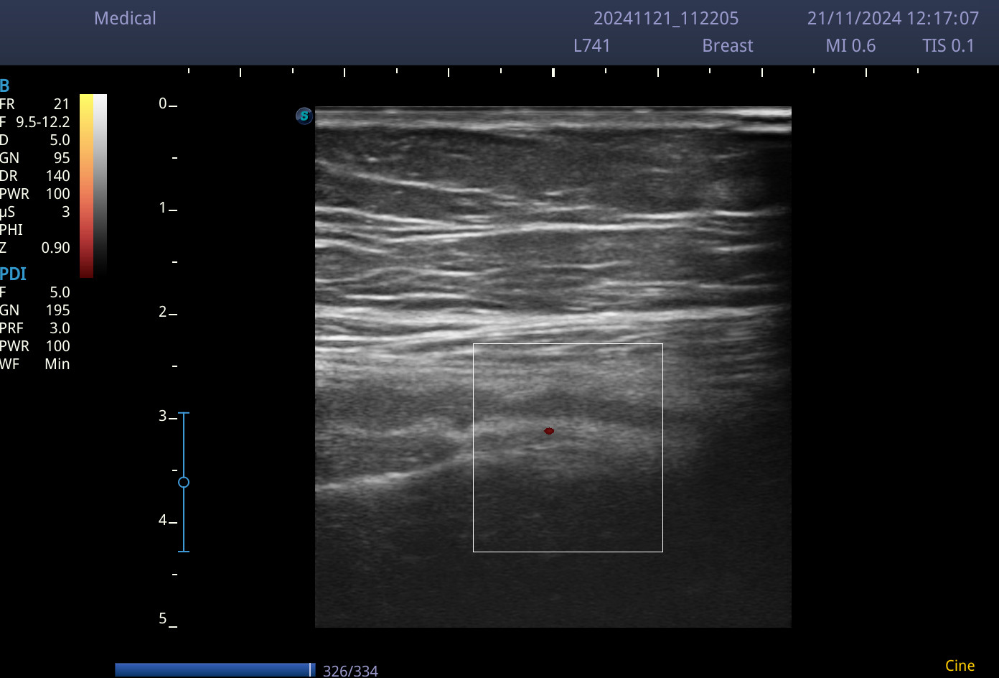  
*Прямой снимок брюшной полости с УЗИ-аппарата*

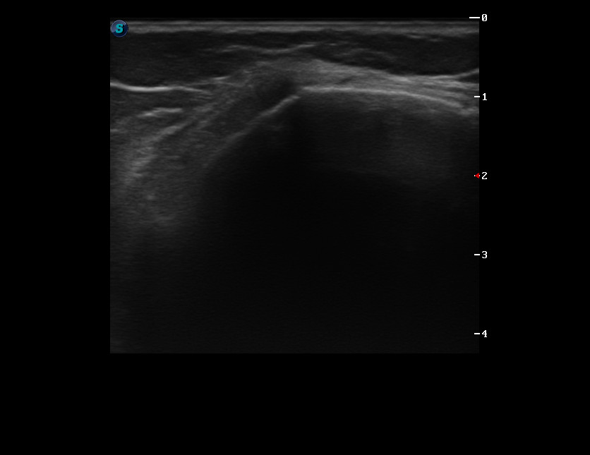  
*Прямой снимок плечевого сустава с УЗИ-аппарата*

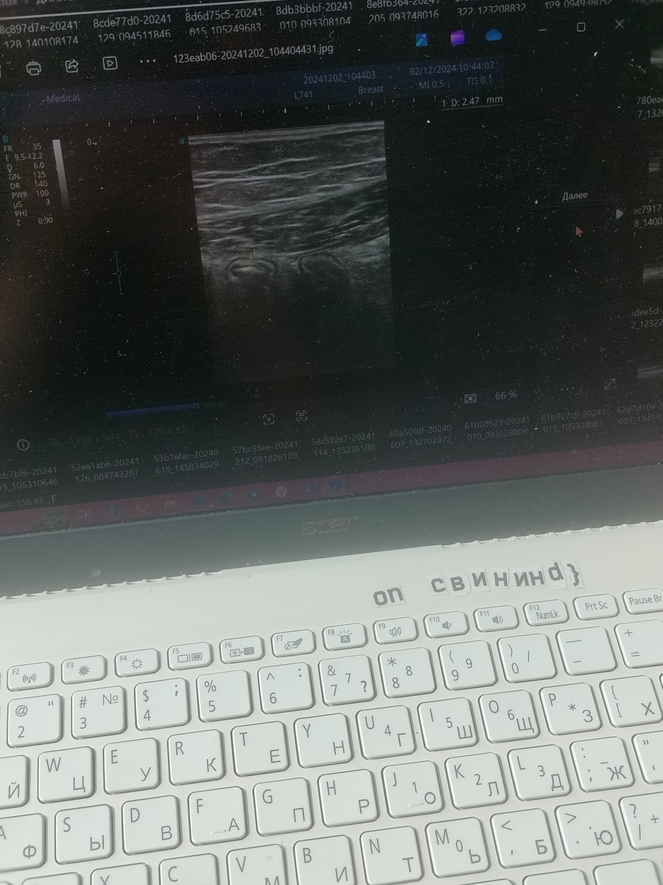  
*Фото экрана УЗИ через камеру телефона*

## Результаты обучения

| Метрика       | U-Net  | YOLOv11 |
|---------------|--------|---------|
| Dice          | 0.8279 | 0.9385  |
| IoU           | 0.7678 | 0.8788  | 
| Accuracy      | 0.9770 | 0.9881  |
| Время (мс)    | 644    | 412     |

**Визуальное сравнение**:

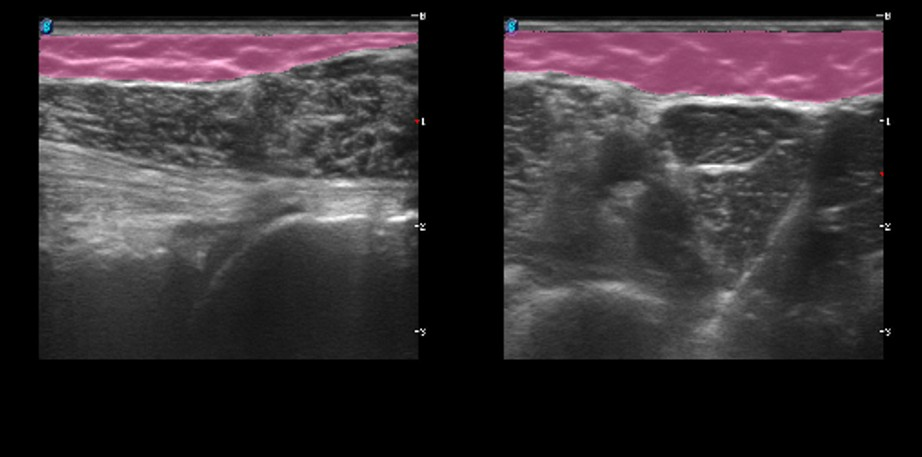  
*Результаты сегментации U-Net*

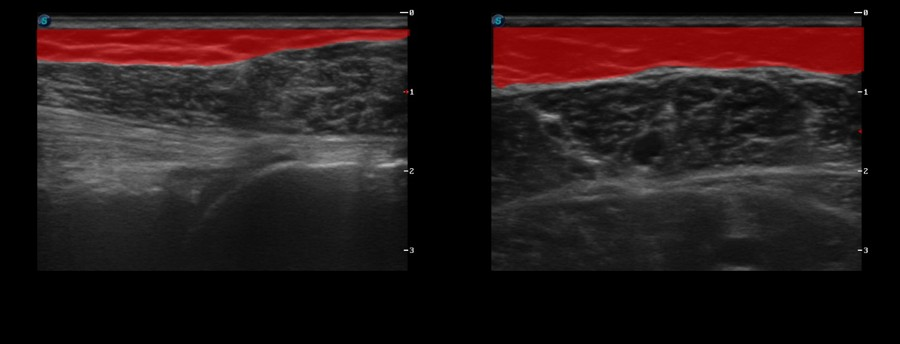  
*Результаты сегментации YOLOv11*

**Итоговые результаты с YOLOv11 в приложении на различных входных данных**:

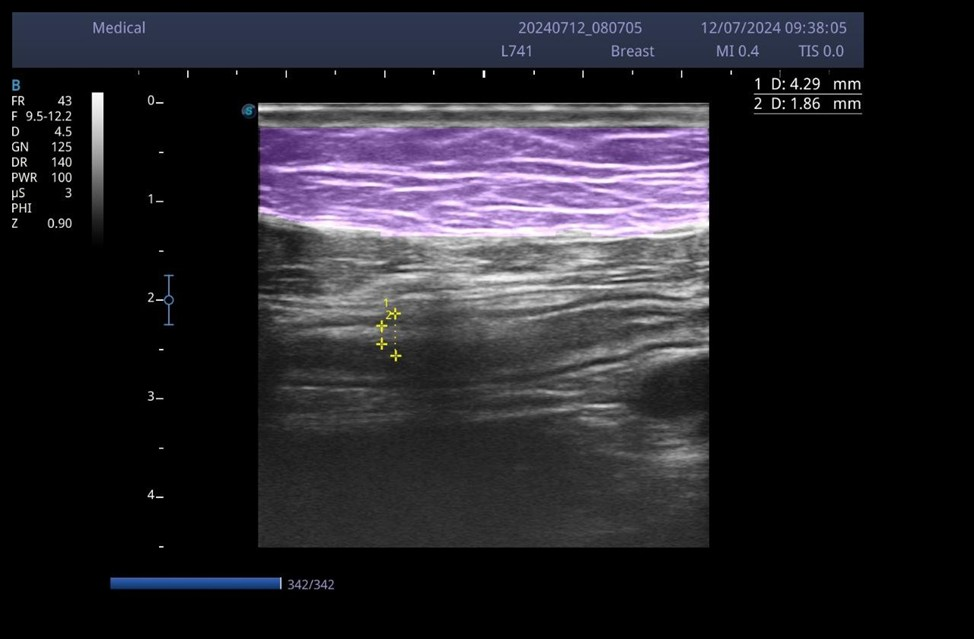  
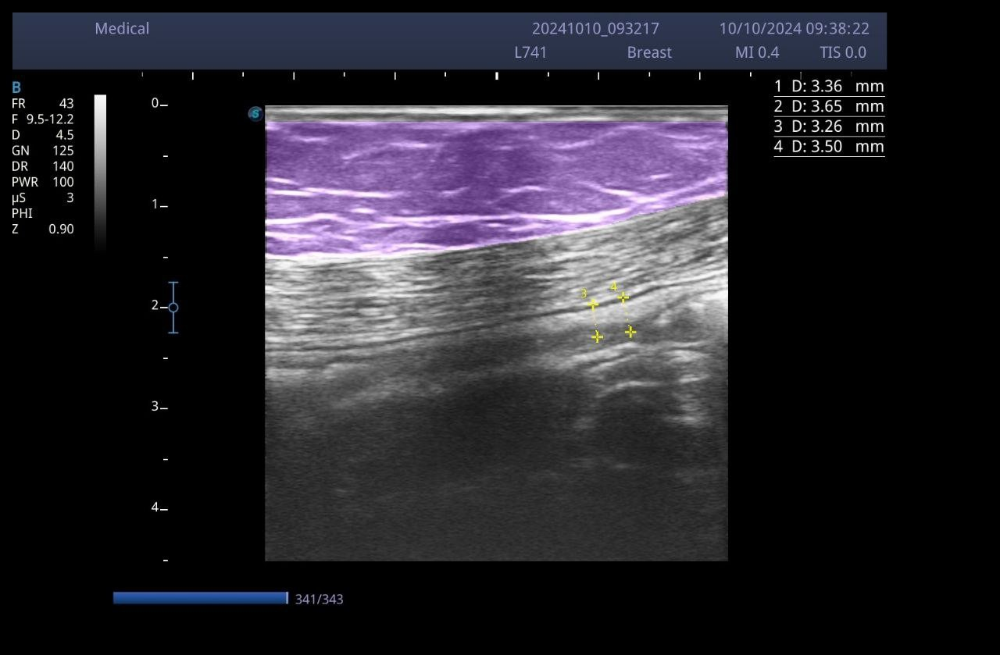  
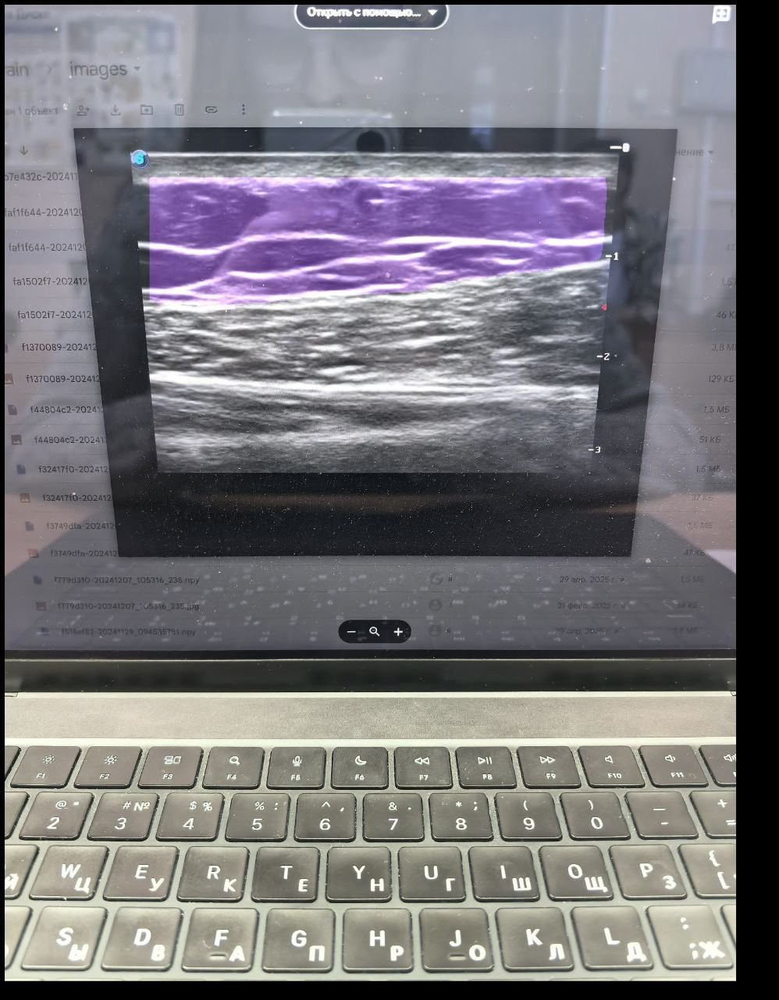  
*Результаты сегментации YOLOv11*

## Реализация

### Мобильное приложение
**Основные функции**:
1. Загрузка изображений: пользователь может сделать снимок с камеры устройства или выбрать изображение из галереи.
2. Инструменты редактирования:
   - Обрезка
   - Поворот
   - Масштабирование
   - Лассо-выделение
3. Сегментация: изображение отправляется на сервер, где обрабатывается моделью YOLOv11. Результат возвращается в виде маски, наложенной на исходное изображение.
4. Визуализация и сохранение результатов: пользователь может сохранить обработанное изображение в локальное хранилище.

**Скриншоты**:

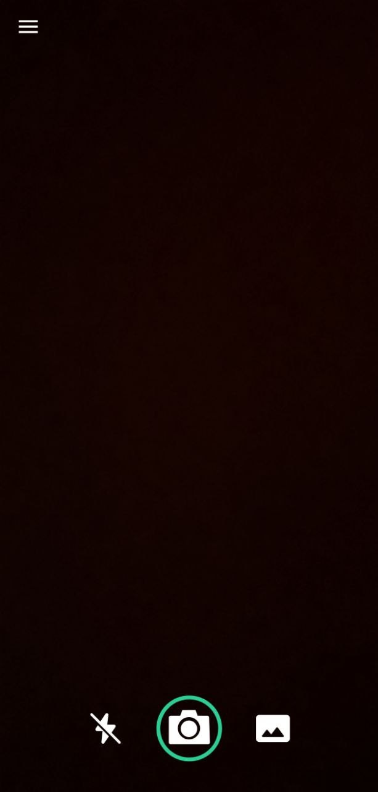  
*Главный экран приложения*

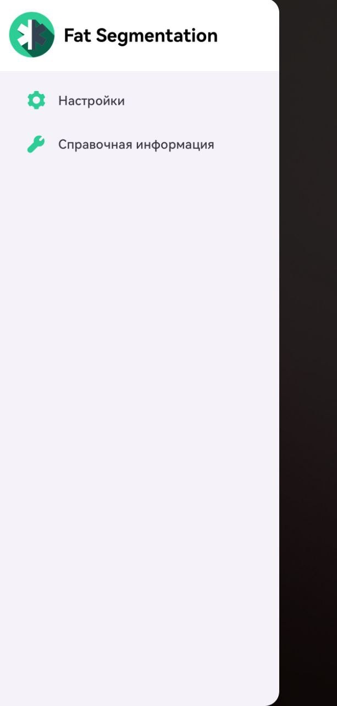  
*Окно параметров*

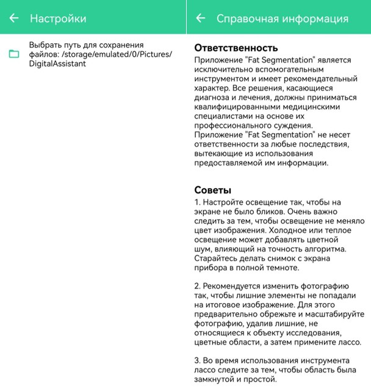  
*Окно настроек и советов по использованию*

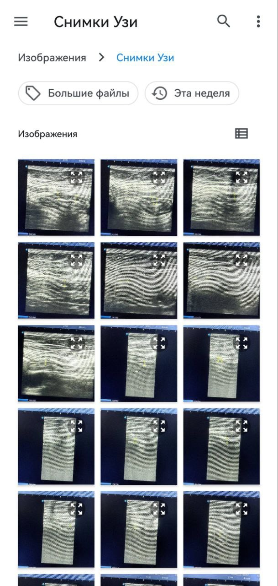  
*Выбор источника изображения*

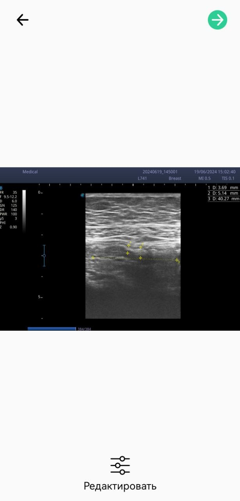  
*Окно предпросмотра*

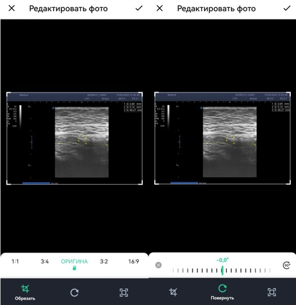  
*Функции редактирования*

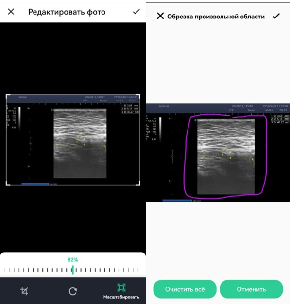  
*Функции редактирования*

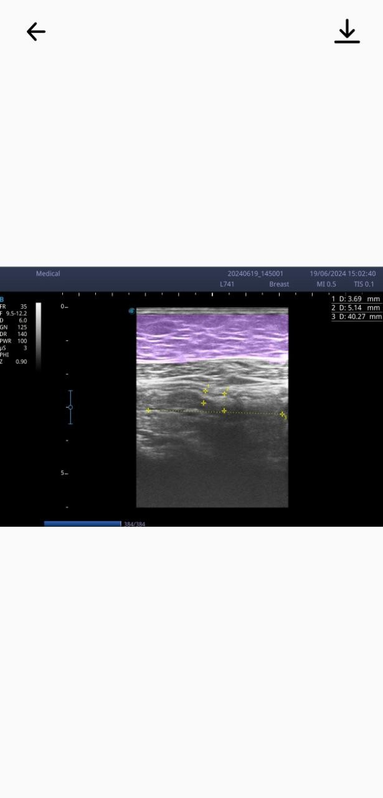  
*Окно вывода результата*

## Итоговый результат

[Скачать приложение](https://drive.google.com/drive/folders/1Z9TFPVytuTpsVGy4rx6Y4o3fNfRs8id7?usp=sharing)

## Дополнительные материалы

- [Текст дипломной работы](ссылка)
- [Презентация проекта](ссылка)
